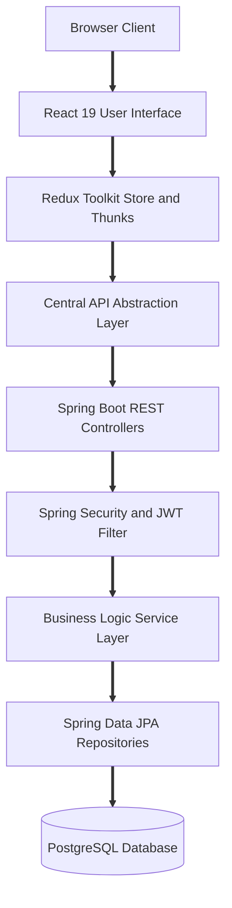

# GOPASS: Full Stack Event Discovery and Digital Pass Platform

Live Deployment: https://gopass-main.vercel.app/
Frontend : Vercel
Backend : Render (So it will take time for the first api call you make)

## Repository Consolidation

Earlier, the frontend and the backend of this project were developed and maintained across two separate repositories.  

## Project Overview

GOPASS is an event discovery, registration, and digital pass management platform designed for college campuses, tech symposiums, hackathons, and cultural fests. The platform connects students, event organizers, and college administrators into a single collaborative ecosystem.

Key capabilities include:

* Discovery of college events with detailed schedules, venues, and registration criteria
* Role based access control tailored for Students, Organizers, and Administrators
* Seamless digital registration and digital event pass generation
* Organizer management console for publishing events and tracking attendees
* Administrator review portal for approving campus organizers and monitoring platform activity
* Highly responsive user interface with fluid micro interactions and Three.js visual elements

## Architecture and System Design

GOPASS implements a decoupled client server architecture. The frontend operates as a single page application built on React and Vite, while the backend is powered by a robust Spring Boot REST API backed by PostgreSQL.



### Architectural Tiers

1. Presentation Tier
   Built with React 19 and TailwindCSS. It utilizes GSAP, Framer Motion, and Three.js to provide an engaging visual experience. All route access is guarded according to user authentication state and assigned roles.

2. State and Client Service Tier
   Application state is centrally managed through Redux Toolkit slices (authSlice and eventsSlice). Network interactions are routed through a dedicated API abstraction layer located at src/api, decoupling component presentation from data fetching logic.

3. Application Server Tier
   A Java 21 Spring Boot REST API handles request routing, input validation, role verification, and business operations.

4. Security and Identity Tier
   Stateless authentication using JSON Web Tokens (JWT). The JwtAuthenticationFilter intercepts each incoming request, validates the cryptographic signature, and sets the authenticated security context.

5. Data Persistence Tier
   Relational data models mapped via Spring Data JPA and Hibernate, persisting user accounts, college profiles, event details, and ticket registrations in PostgreSQL.

## Frontend Architecture and Features

The frontend is structured to ensure fast loading times, reactive state updates, and intuitive user journeys.

### Core Modules

* Route Protection and Navigation
  The application utilizes React Router to define public, protected, and role specific paths. The ProtectedRoute component verifies authentication, while DashboardRouter guides users to their respective portal based on their verification status and role.

* Centralized State Management
  Redux Toolkit coordinates global state. Asynchronous operations such as login, signup, and event fetching are dispatched via createAsyncThunk, maintaining consistent loading, success, and error states across views.

* Visual Experience and Canvas Graphics
  Interactive landing pages feature custom Three.js canvas backgrounds, smooth scrolling powered by Lenis, and transition effects built with Framer Motion and GSAP.

* Role Portals
  Dedicated interfaces are provided for each persona:
  * Student Portal: Event exploration, filter by college, instant registration, and access to issued digital passes.
  * Organizer Portal: Event creation wizard, publishing controls, and live participant lists.
  * Administrator Portal: Verification review queue for organizer applications and college listings.

## API Integration and Communication Flow

Communication between the React client and the Spring Boot backend follows a structured pipeline:

1. User Action
   The user triggers an interaction such as registering for an event, submitting an event creation form, or logging in.

2. Thunk Dispatch
   The UI component dispatches an asynchronous action through Redux Toolkit.

3. API Abstraction
   The service file in Frontend/src/api formats the payload, attaches the Bearer token to the Authorization header, and dispatches the HTTP request.

4. Token Authentication
   The Spring Boot JwtAuthenticationFilter intercepts the request, decodes the token claims, verifies expiry and signature, and establishes the user principal.

5. Role Authorization
   Controller endpoints enforce permissions using Spring Security annotations such as PreAuthorize for administrator and organizer actions.

6. Business Processing
   The corresponding service (EventService, AuthService, EventRegistrationService, or AdminService) applies validation rules and executes transactions.

7. Database Operations
   Spring Data JPA repositories persist changes or retrieve records from the PostgreSQL database.

8. State Propagation
   The REST API responds with status codes and structured DTOs (EventResponse, AuthenticationResponse, UserDto). The Redux store updates, triggering an instantaneous reactive render in the browser.

## API Endpoints Reference

### Authentication Endpoints

* POST /auth/register
  Registers a new user account with student, organizer, or admin credentials.

* POST /auth/login
  Authenticates user credentials and returns a signed JWT token with user profile metadata.

### Event Endpoints

* GET /api/event/allEvent
  Retrieves a paginated list of all published campus events.

* GET /api/event/{eventId}
  Fetches full details, venue, time, and guidelines for a single event.

* POST /api/event/saveEvent
  Allows verified organizers to create and publish a new event.

* GET /api/event/organizerEvent
  Returns all events created by the currently authenticated organizer.

### Registration and Pass Endpoints

* POST /api/registrations/{eventId}
  Registers the logged in student for an event and generates a registration record.

* GET /api/registrations/userRegistrations
  Retrieves all event passes and registrations belonging to the current user.

* GET /api/registrations/event/{eventId}
  Enables the event organizer to retrieve the roster of registered attendees for a specific event.

### Administration Endpoints

* GET /api/admin/pending-organizers
  Returns all organizer accounts pending administrative approval.

* POST /api/admin/approve/{userId}
  Grants verified status to an organizer account.

## Technology Stack

### Frontend

* Library: React 19
* Build Tool: Vite
* State Management: Redux Toolkit
* Routing: React Router DOM
* Styling: TailwindCSS, PostCSS
* Animation and Graphics: GSAP, Framer Motion, Lenis Smooth Scroll, Three.js
* Icons: Lucide React

### Backend

* Framework: Spring Boot 4
* Runtime: Java 21
* Security: Spring Security with JWT Authentication
* Data Access: Spring Data JPA, Hibernate
* Database: PostgreSQL
* Utilities: Lombok, Jakarta Validation

## Project Directory Structure

```text
Gopass FULL/
  Frontend/
    public/ (static public assets)
    src/
      api/ (central API abstraction services)
      assets/ (branding assets and graphics)
      components/ (reusable UI components and canvas)
      context/ (authentication context)
      mocks/ (local testing data)
      pages/ (route views and role dashboards)
      store/ (Redux Toolkit store and slices)
      utils/ (constants and role configurations)
      App.jsx (route configurations and guards)
      main.jsx (application bootstrap)
    package.json (frontend dependencies and scripts)
    vite.config.js (Vite configuration)

  Backend/
    src/main/java/com/college/eventhub/
      config/ (security and JWT filter configuration)
      controller/ (REST API endpoints)
      dto/ (data transfer objects)
      entity/ (database entities)
      repository/ (Spring Data JPA repositories)
      service/ (business logic services)
    src/main/resources/
      application.properties (database and JWT settings)
    pom.xml (Maven build configuration)
    Dockerfile (container specification)
```

## Getting Started

### Prerequisites

* Node.js version 18 or higher
* npm version 9 or higher
* Java Development Kit JDK version 21
* Apache Maven version 3.9 or higher
* PostgreSQL database server

### 1. Database Configuration

Create a PostgreSQL database named gopass. Configure connection details in Backend/src/main/resources/application.properties or set the corresponding environment variables:

```properties
spring.datasource.url=jdbc:postgresql://localhost:5432/gopass
spring.datasource.username=postgres
spring.datasource.password=your_password
application.security.jwt.secret-key=your_jwt_secret_key
```

### 2. Backend Setup

1. Navigate to the backend directory:
   ```bash
   cd Backend
   ```

2. Build the project using Maven:
   ```bash
   mvn clean install
   ```

3. Start the Spring Boot application:
   ```bash
   ./mvnw spring-boot:run
   ```

The backend server starts on port 8080 by default.

### 3. Frontend Setup

1. Open a new terminal and navigate to the frontend directory:
   ```bash
   cd Frontend
   ```

2. Install dependencies:
   ```bash
   npm install
   ```

3. Start the Vite development server:
   ```bash
   npm run dev
   ```

The frontend application will be accessible at http://localhost:5173.

## Live Deployment

Experience the live application hosted on Vercel:

https://gopass-main.vercel.app/

## Authors and Acknowledgments

* Frontend Design and Engineering: Developed with React, Redux Toolkit, and TailwindCSS.
* Backend API and Database Engineering: Developed with Spring Boot, Spring Security, and PostgreSQL.
* Consolidated into this repository to offer an integrated full stack platform experience.
